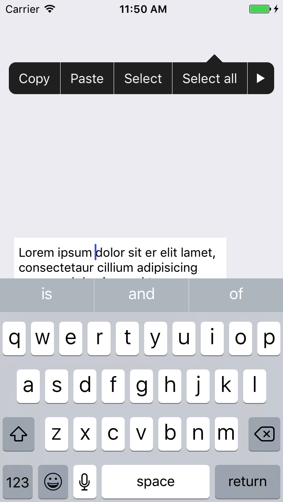
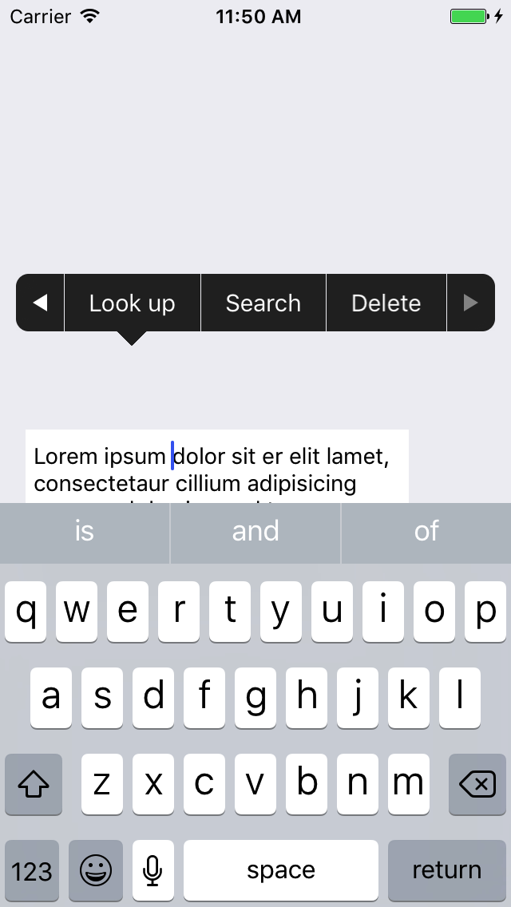

# SWMenuController

Custom menu controller like UIMenuController.

Blog: http://www.cnblogs.com/silence-cnblogs/p/6824426.html

中文博客：http://www.cnblogs.com/silence-cnblogs/p/6824426.html





## How to use

SWMenuController is similar to UIMenuController, but only uses custom menu item and need to set delegate.

```swift
let menu = SWMenuController()
menu.delegate = self
menu.menuItems = ["Copy", "Paste", "Select", "Select all", "Look up", "Search", "Delete"]
menu.setTargetRect(frame, in: view)
menu.setMenuVisible(true, animated: true)
```

Hanle menu button click action at index

```swift
func menuController(_ menu: SWMenuController, didSelected index: Int) {
    print(menu.menuItems[index])
    // Do something for menu at index
}
```

